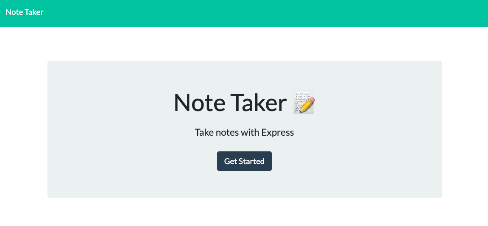

# note-taker
This app uses node.js and Express to create a server-hosted web note-taking application. The user is able to write new notes, save notes, and delete old notes.



## Instructions for Use
* Go to [the Heroku page]('https://note-taker000.herokuapp.com')
* Click ```Get Started```
* Create a title for your note and fill in the note text
* When you are ready, click the save icon in the top right corner
* To start a new note, click the pencil icon in the top right corner
* To see saved notes, refresh the page to have them display on your current page or go to ```note-taker000.herokuapp.com/api/notes``` to see a JSON view of all notes.
* To delete 